<!-- GETTING STARTED -->
## Getting Started

Proyek ini dirancang untuk memenuhi tugas minggu ke-4 mata kuliah Integrasi Aplikasi Enterprise. Proyek ini merupakan Sistem Informasi Sederhana dari Kantin T-Mart Gedung TULT, yang dibuat menggunakan ExpressJS dengan menerapkan konsep MVC sederhana. Proyek ini memiliki fitur utama (sesuai instruksi) yang dapat dijalankan melalui Postman ataupun SwaggerUI, antara lain:

1. Fitur Login User - `POST /auth/login` 
2. Fitur Edit Profile User (wajib Token) - `PUT /profile`
3. Fitur Lihat Daftar Menu (tanpa Token) - `GET /items`


### Cara Setup Environment

Berikut merupakan tahap instalasi yang harus dilakukan untuk menjalankan proyek ini, jalankan sintaks berikut menggunakan Terminal di perangkat anda.

1. Install NodeJS di perangkat anda melalui https://nodejs.org/id/download 
2. Clone repository Github
   ```sh
   git clone https://github.com/zamzamyst/IAE-TMART-APP.git
   ```
3. Masuk ke direktorinya
   ```sh
   cd IAE-TMART-APP/
   ```
4. Install package utama (NPM)
   ```sh
   npm install express cors dotenv jsonwebtoken bcryptjs swagger-ui-express swagger-jsdoc
   ```
5. Salin file `.env.example` menjadi `.env`
   ```sh
    cp .env.example .env
    ```
6. Konfigurasi PORT dan JWT_SECRET_KEY anda di dalam file `.env`
7. Jalankan program
    ```sh
    node src/server.js
    ```


### Cara Setup Postman

Untuk menjalankan proyek T-Mart ini melalui Postman, ada beberapa tahapan yang harus anda lakukan terlebih dahulu, antara lain:

1. Cari file `JWT-Marketplace-API.postman_collection.json` di dalam direktori proyek
2. Buka Postman
3. Pilih menu `Import` di bagian Workspace
4. Import file `JWT-Marketplace-API.postman_collection.json`
5. Collection API siap digunakan, mencakup:


### Cara Menjalankan Program melalui Postman

Ada beberapa skenario yang harus anda lakukan pada proyek T-Mart ini (sesuai instruksi tugas), antara lain:

#### Skenario Login
1. Skenario 1 (Email & Password sesuai)
    - Buka request `POST` yang bernama `Login`
    - Sesuaikan URL dengan PORT milik anda
    - Buka tab `Body`
    - Pilih opsi `raw` dan format `JSON`
    - Isi `email` dengan `user1@example.com`
    - Isi `password` dengan `pass123`
    - Jalankan request
    - Proses login telah berhasil dengan response `200 OK` dan output `access_token`
    - Lihat decode JWT melalui Console atau https://www.jwt.io/ (Opsional) 

    Contoh Uji Postman:
    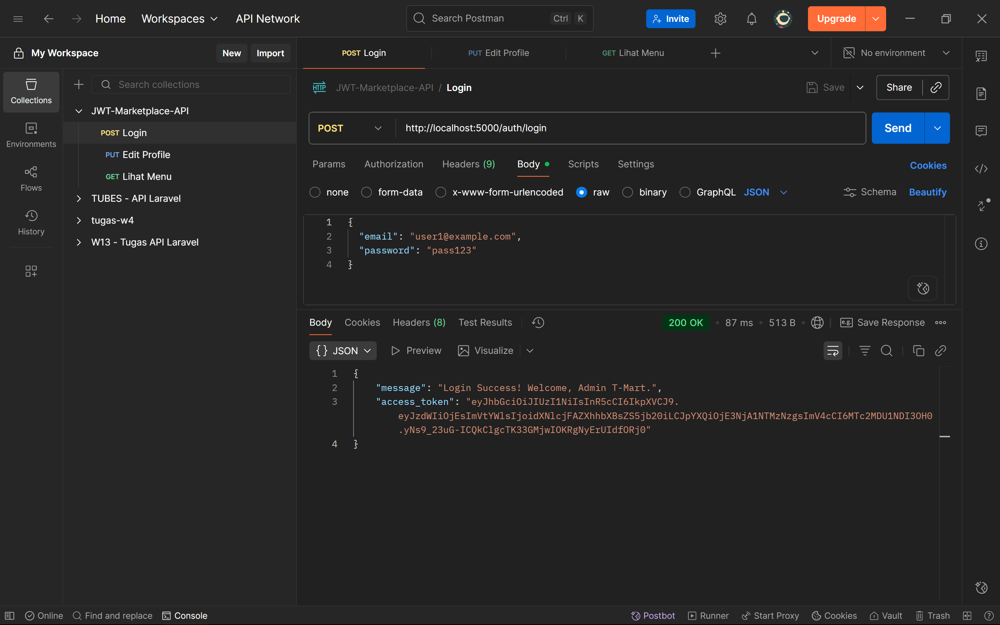

2. Skenario 2 (Email sesuai & Password salah)
    - Buka request `POST` yang bernama `Login`
    - Sesuaikan URL dengan PORT milik anda
    - Buka tab `Body`
    - Pilih opsi `raw` dan format `JSON`
    - Isi `email` dengan `user1@example.com`
    - Isi `password` dengan nilai yang salah, misal `password123`
    - Jalankan request
    - Proses login gagal, dengan response `401 Unauthorized` beserta error message-nya

    Contoh Uji Postman:
    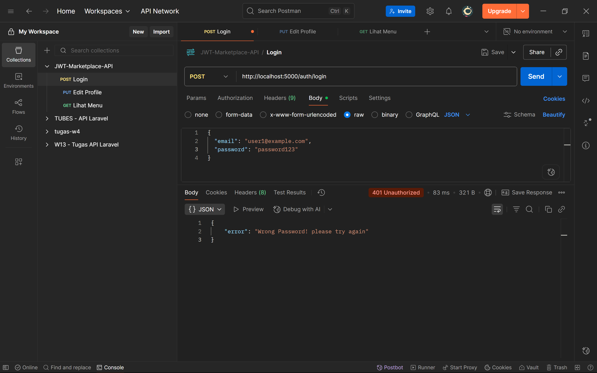

3. Skenario 3 (Email salah & Password sesuai)
    - Buka request `POST` yang bernama `Login`
    - Sesuaikan URL dengan PORT milik anda
    - Buka tab `Body`
    - Pilih opsi `raw` dan format `JSON`
    - Isi `email` dengan nilai yang salah, misal `customer@example.com`
    - Isi `password` dengan `pass123`
    - Jalankan request
    - Proses login gagal, dengan response `404 Not Found` beserta error message-nya

    Contoh Uji Postman:
    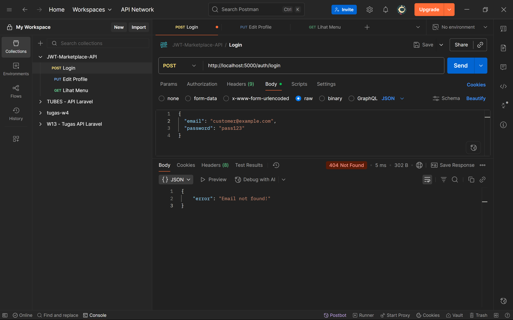

#### Skenario Edit Profile
1. Skenario 1 (Token valid)
    - Salin `access_token` yang anda dapatkan saat berhasil Login
    - Buka request `PUT` yang bernama `Edit Profile`
    - Sesuaikan URL dengan PORT milik anda
    - Buka tab `Headers`
    - Pilih opsi `Authorization` pada kolom Key 
    - Isi kolom Value dengan `Bearer {{access_token}}`
    - Buka tab `Body`
    - Pilih opsi `raw` dan format `JSON`
    - Isi `name` dengan nama baru yang diinginkan, misal `Nama Baru`
    - Jalankan request
    - Profil berhasil diperbarui, dengan response `200 OK` beserta message dan data-nya

    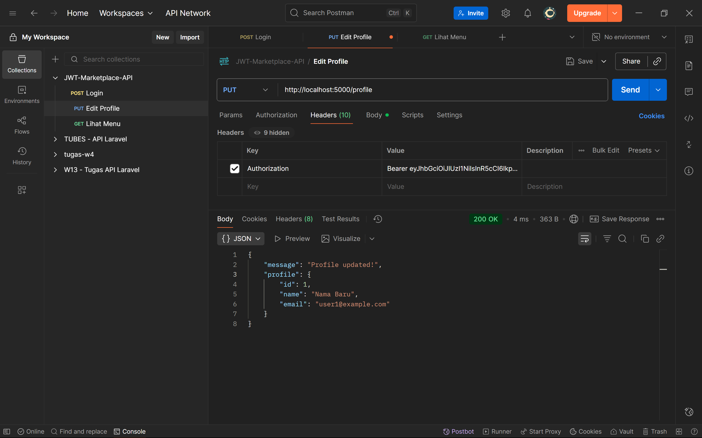

2. Skenario 2 (Token Tidak Valid)
    - Salin `access_token` yang anda dapatkan saat berhasil Login
    - Buka request `PUT` yang bernama `Edit Profile`
    - Sesuaikan URL dengan PORT milik anda
    - Buka tab `Headers`
    - Pilih opsi `Authorization` pada kolom Key 
    - Isi kolom Value dengan `Bearer {{access_token}}`, lalu hilangkan sebagian digit-nya
    - Buka tab `Body`
    - Pilih opsi `raw` dan format `JSON`
    - Isi `name` dengan nama baru yang diinginkan, misal `Nama Baru`
    - Jalankan request
    - Profil gagal diperbarui, dengan response `403 Forbidden` beserta message error-nya

    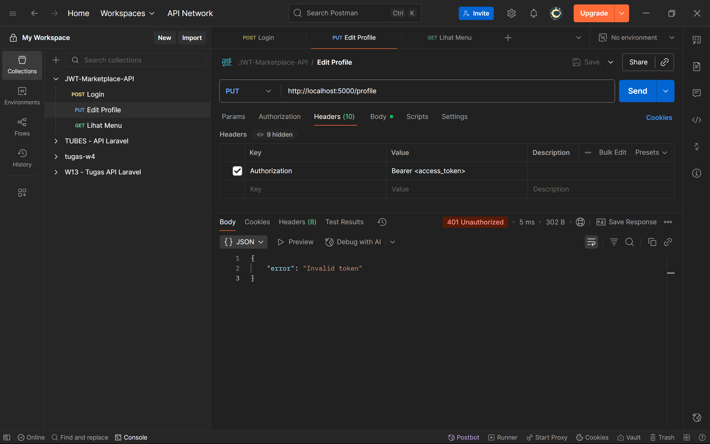

3. Skenario 3 (Token Expired)
    - Salin `access_token` yang anda dapatkan saat berhasil Login
    - Tunggu sekitar 15 menit hingga token expired
    - Buka request `PUT` yang bernama `Edit Profile`
    - Sesuaikan URL dengan PORT milik anda
    - Buka tab `Headers`
    - Pilih opsi `Authorization` pada kolom Key 
    - Isi kolom Value dengan `Bearer {{access_token}}`
    - Buka tab `Body`
    - Pilih opsi `raw` dan format `JSON`
    - Isi `name` dengan nama baru yang diinginkan, misal `Nama Baru`
    - Jalankan request
    - Profil gagal diperbarui, dengan response `401 Unauthorized` beserta message error-nya

    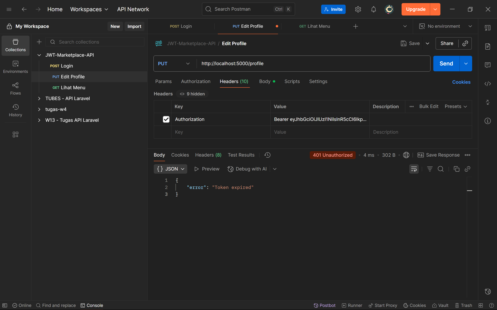

#### Skenario Lihat Daftar Menu
1. Skenario 1 (Sukses menampilkan Daftar Menu)
    - Buka request `GET` yang bernama `Lihat Menu`
    - Sesuaikan URL dengan PORT milik anda
    - Jalankan request
    - Daftar Menu berhasil ditampilkan, dengan response `200 OK` beserta message dan data-nya

    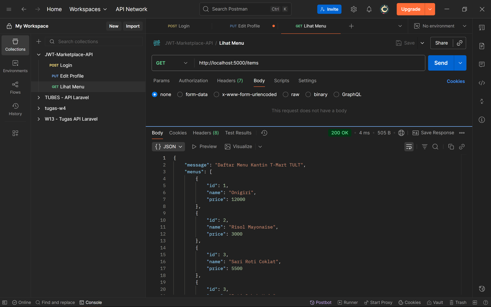


### Cara Menjalankan Program melalui SwaggerUI

Selain melalui Postman, Anda juga bisa menjalankan proyek T-Mart ini melalui Swagger Docs, UI interaktif yang di dalamnya terdapat dokumentasi terkait seluruh request yang kami gunakan pada proyek ini. Untuk cara menjalankannya antara lain:

#### Skenario Login
1. Skenario 1 (Email & Password sesuai)
    - Buka URL http://localhost:5001/api-docs (sesuaikan dengan PORT anda)
    - Pilih opsi request POST /auth/login
    - Klik tombol `Try it out`
    - Isi `email` dengan `user1@example.com`
    - Isi `password` dengan `pass123`
    - Klik tombol `Execute`
    - Proses login telah berhasil dengan response `200 OK` dan output `access_token`
    - Lihat decode JWT melalui Console atau https://www.jwt.io/ (Opsional) 

    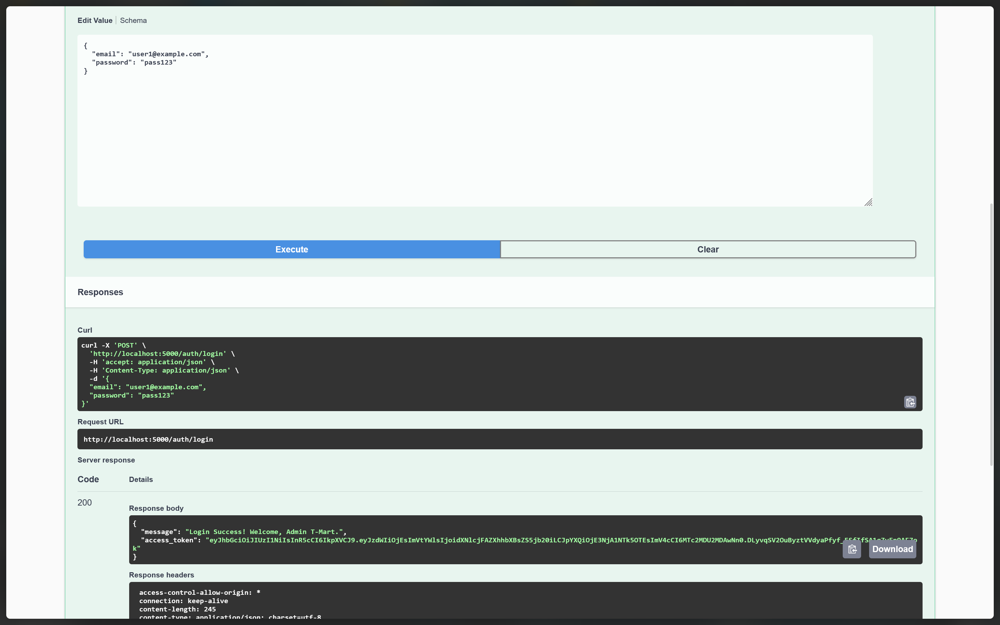

2. Skenario 2 (Email sesuai & Password salah)
    - Buka URL http://localhost:5001/api-docs (sesuaikan dengan PORT anda)
    - Pilih opsi request POST /auth/login
    - Klik tombol `Try it out`
    - Isi `email` dengan `user1@example.com`
    - Isi `password` dengan nilai yang salah, misal `password123`
    - Klik tombol `Execute`
    - Proses login gagal, dengan response `401 Unauthorized` beserta error message-nya

    

3. Skenario 3 (Email salah & Password sesuai)
    - Buka URL http://localhost:5001/api-docs (sesuaikan dengan PORT anda)
    - Pilih opsi request POST /auth/login
    - Klik tombol 'Try it out'
    - Isi `email` dengan nilai yang salah, misal `customer@example.com`
    - Isi `password` dengan `pass123`
    - Klik tombol `Execute`
    - Proses login gagal, dengan response `404 Not Found` beserta error message-nya

    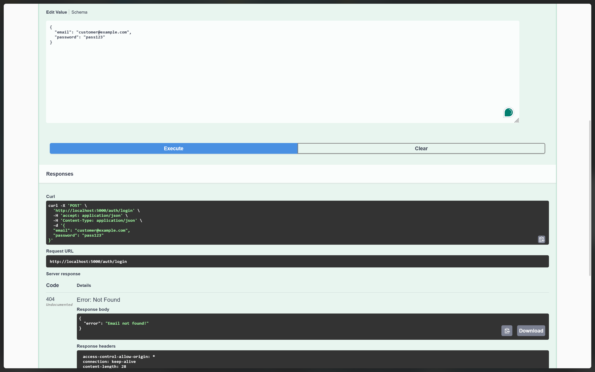

#### Skenario Edit Profile
1. Skenario 1 (Token valid)
    - Salin `access_token` yang anda dapatkan saat berhasil Login
    - Klik tombol `Authorize`
    - Masukkan `access_token` pada kolom yang tersedia
    - Pilih opsi request PUT /profile
    - Klik tombol 'Try it out'
    - Isi `name` dengan nama baru yang diinginkan, misal `Nama Baru`
    - Klik tombol `Execute`
    - Profil berhasil diperbarui, dengan response `200 OK` beserta message dan data-nya

    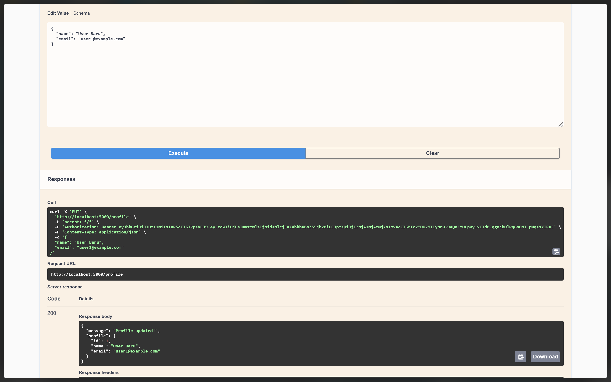

2. Skenario 2 (Token Tidak Valid)
    - Salin `access_token` yang anda dapatkan saat berhasil Login
    - Klik tombol `Authorize`
    - Masukkan hanya sebagian digit `access_token` pada kolom yang tersedia
    - Pilih opsi request PUT /profile
    - Klik tombol 'Try it out'
    - Isi `name` dengan nama baru yang diinginkan, misal `Nama Baru`
    - Klik tombol `Execute`
    - Profil gagal diperbarui, dengan response `401 Unauthorized` beserta message error-nya

    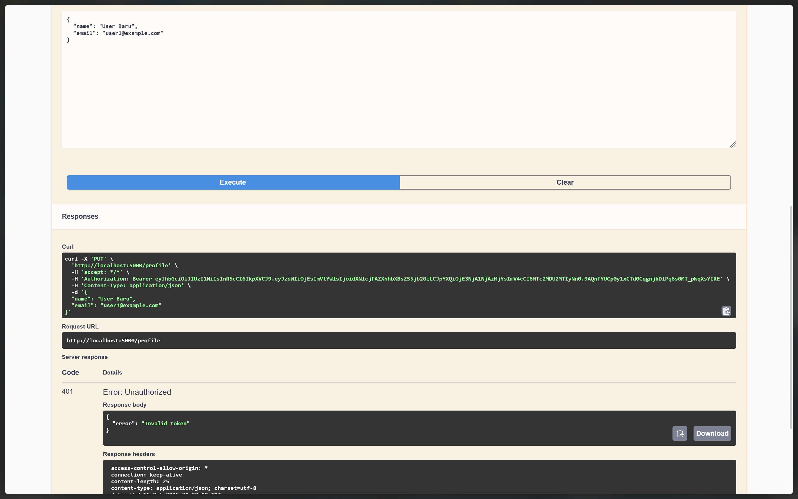

3. Skenario 3 (Token Expired)
    - Salin `access_token` yang anda dapatkan saat berhasil Login
    - Klik tombol `Authorize`
    - Masukkan `access_token` pada kolom yang tersedia
    - Tunggu sekitar 15 menit hingga token expired
    - Pilih opsi request PUT /profile
    - Klik tombol 'Try it out'
    - Isi `name` dengan nama baru yang diinginkan, misal `Nama Baru`
    - Klik tombol `Execute`
    - Profil gagal diperbarui, dengan response `401 Unauthorized` beserta message error-nya

    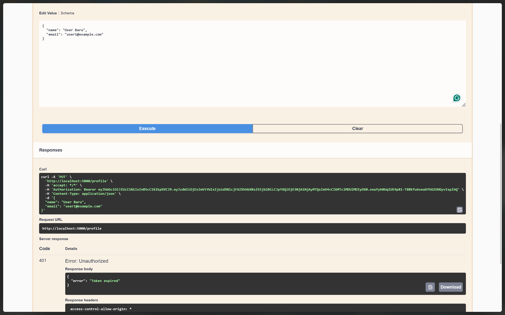
    
#### Skenario Lihat Daftar Menu
1. Skenario 1 (Sukses menampilkan Daftar Menu)
    - Buka URL http://localhost:5001/api-docs (sesuaikan dengan PORT anda)
    - Pilih opsi request GET /items
    - Klik tombol `Try it out`
    - Daftar Menu berhasil ditampilkan, dengan response `200 OK` beserta message dan data-nya

    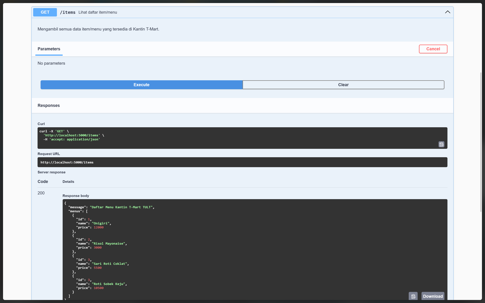


<p align="right">(<a href="#readme-top">back to top</a>)</p>
